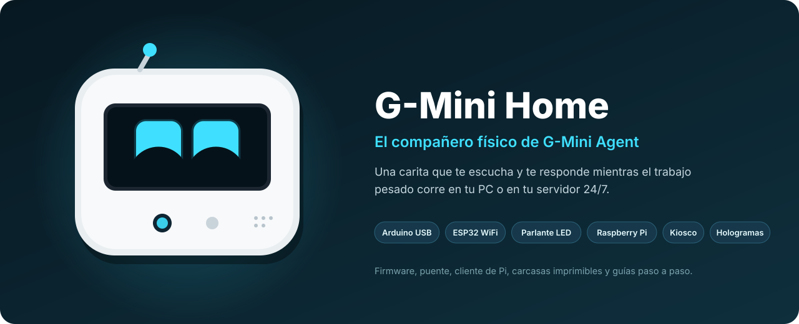
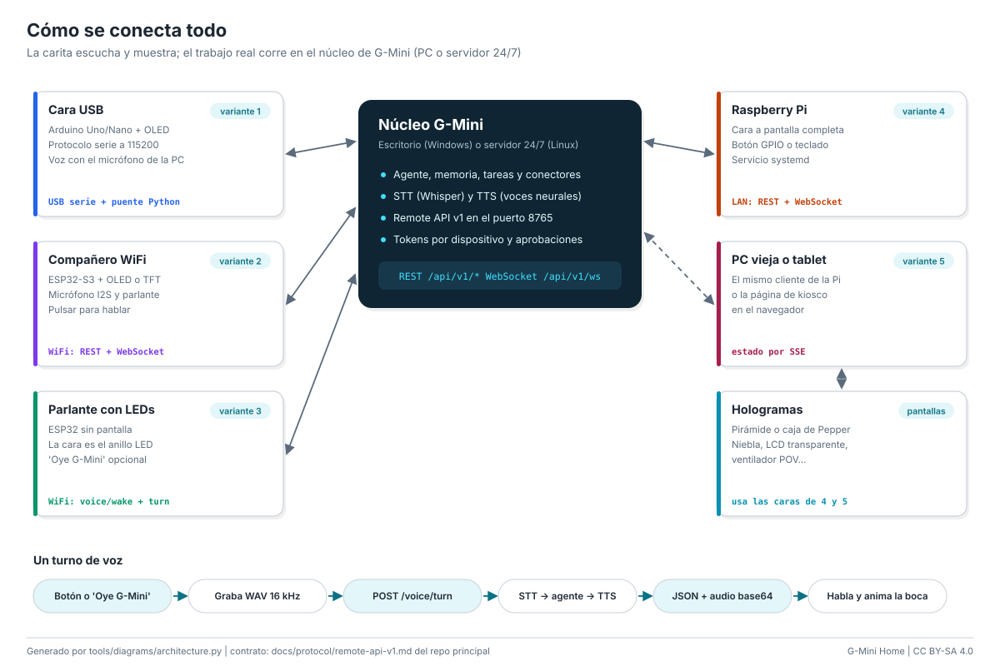

<p align="center">
  
</p>

# G-Mini Home

**The physical companion for [G-Mini Agent](https://github.com/angelgabrieljacintohuayllasco/G-Mini-Agent).**
A small face with animated eyes that listens, answers and shows what the agent
is doing, while the real work (driving your PC, reading mail, running 24/7
tasks) happens on your PC or your server.

Think of an "Alexa" with access to your PC, laptop, phone and server: the
device provides the face, microphone and speaker; G-Mini provides the brain.

The documentation is written in Spanish ([README en español](README.md)); this
page summarizes it in English.

## Variants

| | Variant | Hardware | Difficulty | Approx. cost | Guide (ES) |
|---|---|---|---|---|---|
| 1 | **USB face** | Arduino Uno or Nano + 0.96" OLED + 2 buttons, plugged into the PC | Easy | US$ 10-17 | [usb-face](docs/guides/usb-face.md) |
| 2 | **WiFi companion** | ESP32-S3 + OLED (or ST7789 / GC9A01 TFT) + I2S mic + speaker | Medium | US$ 20-30 | [esp32-wifi](docs/guides/esp32-wifi.md) |
| 3 | **LED speaker** | ESP32 + mic + speaker + WS2812 ring (the ring is the face) | Medium | US$ 20-35 | [speaker](docs/guides/speaker.md) |
| 4 | **Raspberry Pi** | Pi 4/5 or Zero 2 W + HDMI/SPI display + USB audio | Easy | US$ 75-140 | [raspberry-pi](docs/guides/raspberry-pi.md) |
| 5 | **Old PC or tablet** | The Pi client on any PC, or the kiosk page in a browser | Very easy | US$ 0 | [kiosk](docs/guides/kiosk.md) |
| | **Holograms** | Pepper's ghost pyramid and box, fog, smoke, transparent LCD, POV fan... | Varies | from US$ 1 | [holograms](docs/holograms/README.md) |

## How it works



Every device talks to the G-Mini core through the **G-Mini Remote API v1**
(REST + WebSocket on port 8765):

- **Pairing** with a 6-digit code (or the `gmini://pair?...` QR link): each
  device gets its own revocable token.
- **Agent state** over WebSocket (`idle`, `listening`, `thinking`, `acting`,
  `speaking` plus an emotion) drives the eyes; `notify` frames show alerts.
- **Voice**: push-to-talk records 16 kHz WAV and posts it to
  `/api/v1/voice/turn` (STT, agent and TTS in one call); the reply is played
  while it streams in. Optional "Oye G-Mini" wake word through `/api/v1/voice/wake`.
- **Node surfaces** the agent can use: `display.face`, `display.text`,
  `led.set`, `relay.set`, `sensor.read`, `system.info`, `tts.speak`.

The eyes come from one engine implemented in C++ (AVR and ESP32), Python (Pi
and PC) and JavaScript (kiosk), all generated from
[`common/expressions.json`](common/expressions.json): natural blinking, moving
gaze, smooth transitions at 30-40 fps and nine emotions.

## Quick start

G-Mini must be reachable from the device (server mode, or "Allow connections"
in Settings > Devices > This computer). See [connect-gmini.md](docs/connect-gmini.md).

```bash
# USB face (Arduino + OLED + a PC running G-Mini)
arduino-cli compile --fqbn arduino:avr:uno --library firmware/libraries/GMiniEyes firmware/arduino-usb-face
arduino-cli upload  --fqbn arduino:avr:uno -p COM5 firmware/arduino-usb-face
cd bridge && pip install -r requirements.txt
python gmini_serial_bridge.py --url http://127.0.0.1:8765 --pair 482913

# WiFi companion: flash gmini-home-esp32s3-oled-factory.bin at 0x0, join the
# "G-Mini-Home-XXXX" access point (password "gminihome") and fill in WiFi,
# server and pairing code.

# Raspberry Pi
cd raspberry-pi && sudo ./install.sh --url http://192.168.1.50:8765 --pair 482913
```

## Development

```bash
pip install -r requirements-dev.txt && pytest           # 87 Python tests
cd firmware/esp32-companion && pio test -e native        # 41 host tests
pio run -e esp32s3-oled                                  # any of the 7 environments
python tools/diagrams/build_all.py                       # SVG diagrams and wiring tables
python tools/render_enclosures.py                        # STL and renders (needs OpenSCAD)
```

CI builds all 7 ESP32 environments and the Uno/Nano sketch, runs native and
Python tests, checks that generated files are up to date and renders the
OpenSCAD enclosures. Every `v*` tag publishes firmware binaries (merged image
for `0x0` plus split parts), `.hex` files, STL files, diagrams and the bridge
and Pi client zips.

## Status

Verified for this version: every firmware environment compiles, native and
Python tests pass, and an end-to-end run against a real G-Mini server covers
pairing, `/me`, WebSocket node registration, TTS, STT and `/voice/wake`.
Still to be validated on assembled hardware: I2S audio, each display and the
LED ring.

## License

Code: [MIT](LICENSE). Hardware designs and documentation:
[CC BY-SA 4.0](LICENSE-hardware.md).
