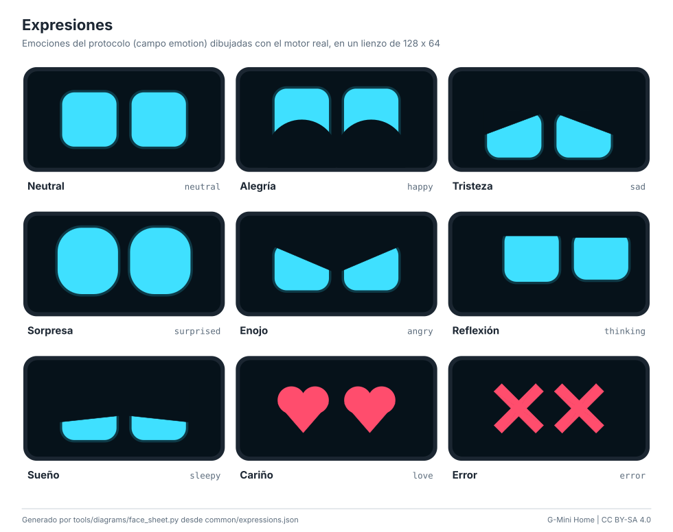

<p align="center">
  
</p>

# G-Mini Home

**El compañero físico de [G-Mini Agent](https://github.com/angelgabrieljacintohuayllasco/G-Mini-Agent).**
Una carita con ojos animados que te escucha, te responde y muestra lo que
está haciendo el agente, mientras el trabajo real (controlar la PC, revisar el
correo, ejecutar tareas 24/7) corre en tu PC o en tu servidor.

Piensa en un "Alexa" con acceso a tu PC, tu laptop, tu celular y tu servidor:
el dispositivo pone la cara, el micrófono y el parlante; G-Mini pone el cerebro.

[English version](README.en.md)

## Variantes

| | Variante | Hardware | Dificultad | Costo aprox. | Guía |
|---|---|---|---|---|---|
| 1 | **Cara USB** | Arduino Uno o Nano + OLED 0,96" + 2 botones, conectado a la PC | Fácil | US$ 10-17 / S/ 55-95 | [usb-face](docs/guides/usb-face.md) |
| 2 | **Compañero WiFi** | ESP32-S3 + OLED (o TFT ST7789 / GC9A01) + micrófono I2S + parlante | Media | US$ 20-30 / S/ 115-185 | [esp32-wifi](docs/guides/esp32-wifi.md) |
| 3 | **Parlante con LEDs** | ESP32 + micrófono + parlante + anillo WS2812 (la cara son los LEDs) | Media | US$ 20-35 / S/ 115-220 | [speaker](docs/guides/speaker.md) |
| 4 | **Raspberry Pi** | Pi 4/5 o Zero 2 W + pantalla HDMI/SPI + audio USB | Fácil | US$ 75-140 / S/ 330-650 | [raspberry-pi](docs/guides/raspberry-pi.md) |
| 5 | **PC vieja o tablet** | El cliente de la Pi en cualquier PC, o la página de kiosco | Muy fácil | US$ 0 | [kiosk](docs/guides/kiosk.md) |
| | **Hologramas** | Pirámide y caja de Pepper, niebla, humo, LCD transparente, POV... | Variable | desde US$ 1 / S/ 3 | [hologramas](docs/holograms/README.md) |

<p align="center">
  
</p>

## Cómo funciona


Todos los dispositivos hablan con el núcleo de G-Mini por la **G-Mini Remote
API v1** (REST + WebSocket, puerto 8765):

- **Emparejamiento** con un código de 6 dígitos (o el enlace `gmini://pair?...`
  del QR): cada dispositivo tiene su propio token y se revoca por separado.
- **Estado del agente** por WebSocket (`idle`, `listening`, `thinking`,
  `acting`, `speaking` y la emoción) para animar los ojos, y avisos (`notify`).
- **Voz**: pulsar para hablar graba WAV de 16 kHz y lo envía a
  `/api/v1/voice/turn` (STT, agente y TTS en una sola llamada); la respuesta se
  reproduce mientras llega. "Oye G-Mini" opcional con `/api/v1/voice/wake`.
- **Superficies de nodo**: el agente puede usar el dispositivo (`display.face`,
  `display.text`, `led.set`, `relay.set`, `sensor.read`, `system.info`,
  `tts.speak`).

Los ojos salen de un mismo motor en C++ (AVR y ESP32), Python (Pi y PC) y
JavaScript (kiosco), generado desde [`common/expressions.json`](common/expressions.json):
parpadeo natural, mirada que se mueve, transiciones suaves a 30-40 cuadros por
segundo y nueve emociones. Detalles en [expresiones](docs/expressions.md).

## Empezar

Antes de nada: G-Mini tiene que ser accesible desde el dispositivo (modo
servidor o "Permitir conexiones" en Ajustes > Dispositivos > Este equipo). Ver
[conectar con G-Mini](docs/connect-gmini.md).

**Cara USB en 30 minutos** (Arduino + OLED + PC con G-Mini):

```bash
arduino-cli compile --fqbn arduino:avr:uno --library firmware/libraries/GMiniEyes firmware/arduino-usb-face
arduino-cli upload  --fqbn arduino:avr:uno -p COM5 firmware/arduino-usb-face
cd bridge && pip install -r requirements.txt
python gmini_serial_bridge.py --url http://127.0.0.1:8765 --pair 482913
```

**Compañero WiFi** (ESP32-S3): graba `gmini-home-esp32s3-oled-factory.bin` de
la release en `0x0` (o `pio run -e esp32s3-oled -t upload`), conéctate a la red
`G-Mini-Home-XXXX` (clave `gminihome`) y escribe tu WiFi, el servidor y el
código de emparejamiento.

**Raspberry Pi:**

```bash
cd raspberry-pi && sudo ./install.sh --url http://192.168.1.50:8765 --pair 482913
```

## Contenido del repositorio

```
firmware/
  esp32-companion/      firmware WiFi (PlatformIO, Arduino): 7 entornos + pruebas nativas
  arduino-usb-face/     sketch para Uno y Nano
  libraries/GMiniEyes   motor de ojos, rasterizado y protocolo serie (C++ portable)
  libraries/GMiniLink   HTTP, JSON, base64 y WAV en flujo, VAD (C++ portable)
bridge/                 puente serie <-> G-Mini en Python
raspberry-pi/           cliente pygame, instalador y servicio systemd
kiosk/                  página de kiosco para tablets (sin dependencias)
common/                 expressions.json y la biblioteca Python gmini_link
hardware/               BOM, cableado, carcasas OpenSCAD, STL, renders y plantillas
docs/                   guías, hologramas, seguridad, problemas y preguntas frecuentes
tools/                  generadores de presets, diagramas, plantillas y renders
tests/                  pruebas de Python (pytest)
```

## Desarrollo

```bash
pip install -r requirements-dev.txt
pytest                                                   # 87 pruebas de Python
ruff check common bridge raspberry-pi tools tests

cd firmware/esp32-companion
pio test -e native                                       # 41 pruebas en el host (motor, protocolo, HTTP/JSON/WAV)
pio run -e esp32s3-oled                                  # o cualquiera de los 7 entornos

python tools/codegen/gen_expressions.py                  # tras editar common/expressions.json
python tools/diagrams/build_all.py                       # diagramas SVG y tablas de cableado
python tools/templates/pepper_pyramid.py                 # plantillas de la pirámide
python tools/render_enclosures.py                        # STL y renders (necesita OpenSCAD)
python tools/e2e_smoke.py --url http://IP:8765 --pair CODIGO   # prueba contra un G-Mini real
```

La CI compila los 7 entornos del ESP32, el sketch para Uno, Nano y Nano con
bootloader viejo, corre las pruebas nativas y de Python, verifica que los
archivos generados estén al día y renderiza las carcasas con OpenSCAD. Cada
etiqueta `v*` publica una release con los binarios (imagen completa para `0x0`
y piezas sueltas), los `.hex`, los STL, los diagramas y los zips del puente y
del cliente de la Pi.

## Estado

Verificado en esta versión: compilación de todos los entornos del firmware
(tamaños en [grabación](docs/flashing.md)), pruebas nativas y de Python, y una
prueba de punta a punta contra un G-Mini real en modo servidor
(emparejamiento, `/me`, WebSocket con registro de nodo, TTS, STT y
`/voice/wake`). Falta probar con el hardware físico armado: audio I2S, cada
pantalla y el anillo LED se validan al construir el primer prototipo de cada
variante.

## Documentación

- [Conectar con G-Mini](docs/connect-gmini.md) y [protocolo serie](docs/serial-protocol.md)
- [Lista de materiales](hardware/bom.md), [cableado](hardware/README.md#cableado) y [carcasas](hardware/README.md#carcasas)
- [Grabar el firmware](docs/flashing.md)
- [Hologramas](docs/holograms/README.md)
- [Seguridad](docs/safety.md), [solución de problemas](docs/troubleshooting.md) y [preguntas frecuentes](docs/faq.md)
- [Cómo contribuir](CONTRIBUTING.md), [seguridad del proyecto](SECURITY.md) y [cambios](CHANGELOG.md)

## Licencia

Código bajo [MIT](LICENSE). Diseños de hardware y documentación bajo
[CC BY-SA 4.0](LICENSE-hardware.md).
