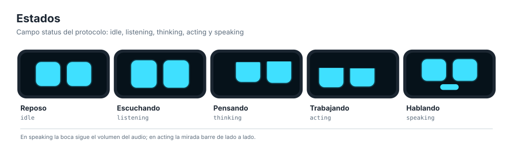

# Expresiones de la cara

Las caras de todas las variantes (OLED, TFT, pygame, kiosco y anillo LED)
salen del mismo motor y de una única tabla: [`common/expressions.json`](../common/expressions.json).




## Cómo funciona el motor

- **Emoción** (campo `emotion` del protocolo) y **estado** (`status`) se
  combinan: la emoción define la forma de los ojos y el estado agrega
  comportamiento (escuchar agranda los ojos, pensar los entrecierra y mira
  arriba, trabajar barre la mirada de lado a lado, hablar muestra la boca).
- Todo cambio se interpola con suavizado exponencial (constante de tiempo de
  70 ms para la forma y 45 ms para la mirada): no hay saltos aunque el agente
  cambie de emoción varias veces por segundo.
- Parpadeo con curva de aceleración (70 ms cerrar, 35 ms cerrado, 110 ms
  abrir), cada 2-6 s al azar y a veces doble, como las personas.
- Movimientos de mirada ("sacadas") al azar en reposo.
- Los cambios de forma (corazones de `love`, cruces de `error`) ocurren con
  los ojos cerrados, en medio de un parpadeo.
- Después de 10 minutos en reposo los ojos se duermen; cualquier evento los
  despierta.
- Todo se calcula en un lienzo de referencia de 128 x 64 y cada pantalla lo
  escala.

Implementaciones: C++ en `firmware/libraries/GMiniEyes` (AVR, ESP32 y host),
Python en `common/gmini_link/face.py` y JavaScript en `kiosk/face.js`. Las
tres leen los presets generados desde el mismo JSON.

## Cambiar una expresión

1. Edita `common/expressions.json`. Por ejemplo, ojos alegres más "sonrientes":

   ```json
   "happy": { "h": 38, "dy": -1, "lid_bottom": 0.55, "bounce": 0.8 }
   ```

2. Regenera los presets y las hojas de referencia:

   ```bash
   python tools/codegen/gen_expressions.py
   python tools/diagrams/build_all.py
   ```

3. Vuelve a compilar el firmware. Las pruebas (`pytest` y
   `pio test -e native`) verifican que las salidas generadas estén al día y que
   los valores estén en rango.

| Campo | Rango | Efecto |
|---|---|---|
| `w`, `h`, `r` | px | Ancho, alto y radio de las esquinas de cada ojo |
| `gap`, `dy` | px | Separación entre ojos y desplazamiento vertical |
| `lid_top` | 0-1 | Párpado superior recto |
| `slant_in` / `slant_out` | 0-1 | Párpado inclinado hacia adentro (enojo) o hacia afuera (tristeza) |
| `lid_bottom` | 0-1 | Párpado inferior en arco (alegría) |
| `look_x`, `look_y` | -1..1 | Hacia dónde mira |
| `scale_l`, `scale_r` | | Tamaño relativo de cada ojo |
| `bounce`, `shake`, `pulse` | | Rebote, sacudida y latido |
| `blink`, `saccade` | [min, max] ms | Intervalos de parpadeo y de movimiento de mirada |
| `shape` | `round`, `heart`, `cross` | Forma del ojo |
| `accent` | bool | Usa el color de acento (rosa) en pantallas a color |

Los `aliases` permiten aceptar nombres extra (`curious` -> `surprised`).
