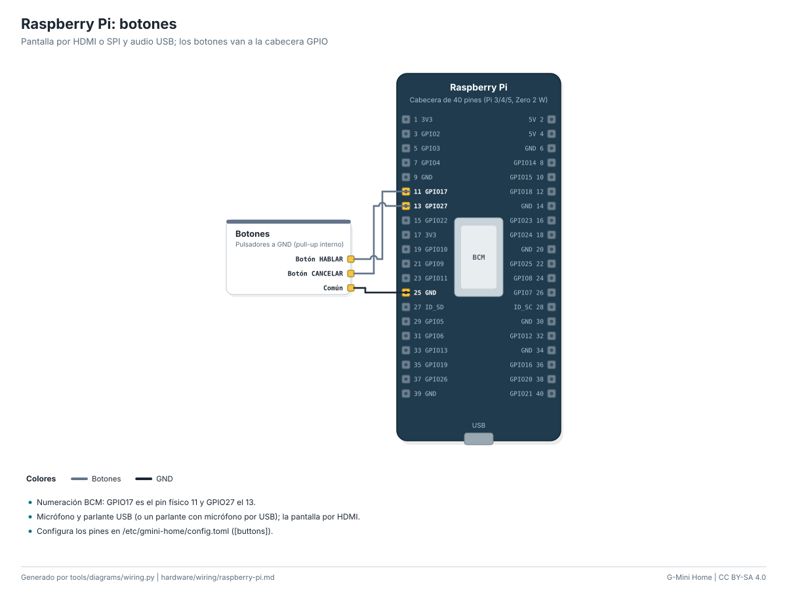

# Variante 4: Raspberry Pi con pantalla

La cara a pantalla completa en cualquier resolución, con voz por micrófono y
parlante USB, botones en los GPIO y palabra de activación opcional. Corre como
servicio de systemd y arranca solo.



**Dificultad:** fácil. **Costo:** US$ 75-140 / S/ 330-650 con Pi 4 y
pantalla de 7" ([BOM](../../hardware/bom.md#variante-4-raspberry-pi-con-pantalla)).
**Tiempo:** 1 hora.

Modelos probados por diseño: Pi 4 y Pi 5 (30-60 cuadros/s), Pi Zero 2 W
(20-24 cuadros/s con `supersample = 1`). Necesita Raspberry Pi OS Bookworm
(Python 3.11).

## 1. Preparar la Pi

1. Graba Raspberry Pi OS (Lite o con escritorio) con Raspberry Pi Imager,
   configurando WiFi, usuario y SSH.
2. Conecta la pantalla (HDMI, o una SPI con su controlador), el micrófono y
   el parlante USB.
3. Botones opcionales entre **GPIO17** (pin 11) y GND (pin 9), y **GPIO27**
   (pin 13) y GND.

## 2. Instalar

```bash
git clone https://github.com/angelgabrieljacintohuayllasco/G-Mini-Agent-Home.git
cd G-Mini-Agent-Home/raspberry-pi
sudo ./install.sh --url http://192.168.1.50:8765 --pair 482913
```

(O descarga el zip `gmini-pi` de la release y ejecuta su `install.sh`.)

El instalador:

- instala Python, PortAudio y SDL;
- copia el código a `/opt/gmini-home` con su propio entorno virtual;
- crea `/etc/gmini-home/config.toml` (no lo pisa al actualizar);
- guarda el token en `/var/lib/gmini-home` (solo lo lee el usuario del servicio);
- registra y arranca `gmini-pi.service`.

Con escritorio (X11/Wayland) agrega `--desktop`. Sin escritorio la cara se
dibuja directo con KMS/DRM.

```bash
systemctl status gmini-pi
journalctl -u gmini-pi -f
```

## 3. Configurar

`/etc/gmini-home/config.toml` (comentado en
[config.example.toml](../../raspberry-pi/config.example.toml)). Lo más usado:

| Clave | Para qué |
|---|---|
| `server.url` | Dirección de G-Mini |
| `display.layout` | `normal`, `mirror` (caja de Pepper) o `pyramid` (pirámide de 4 caras) |
| `display.rotate` | Pantalla montada de costado |
| `display.fps`, `display.supersample` | Fluidez contra consumo de CPU |
| `audio.input`, `audio.output` | Dispositivos (lista: `python -m gmini_pi --list-audio`) |
| `buttons.gpio_talk`, `buttons.gpio_cancel` | Pines BCM de los botones |
| `wake.mode` | `off`, `server` u `openwakeword` |
| `kiosk.enabled`, `kiosk.listen` | Página para tablets ([variante 5](kiosk.md)) |

Después de editar: `sudo systemctl restart gmini-pi`.

## 4. Usarla

- **Espacio** (teclado) o el botón de GPIO17: mantener para hablar.
- **C** o GPIO27: cancelar. **F**: pantalla completa. **Esc**: salir.
- Probar la pantalla sin servidor: `python -m gmini_pi --demo --windowed`.

## 5. Palabra de activación

- `wake.mode = "server"`: igual que en el ESP32, frases cortas viajan a tu
  G-Mini (`/voice/wake`), que decide si dijiste "Oye G-Mini". No necesita
  entrenar nada.
- `wake.mode = "openwakeword"`: detección local con
  [openWakeWord](https://github.com/dscripka/openWakeWord). Instala
  `/opt/gmini-home/venv/bin/pip install openwakeword`, entrena un modelo de
  "Oye G-Mini" con sus herramientas (o prueba con uno de los modelos en
  inglés que trae) y pon la ruta en `wake.model`. El audio no sale de la Pi
  hasta que se detecta la palabra.

## 6. Hologramas

Con `display.layout = "pyramid"` la pantalla muestra cuatro vistas giradas
para una [pirámide de Pepper](../holograms/pyramid.md); con `"mirror"` la cara
sale espejada para una [caja de Pepper](../holograms/pepper-box.md).

## 7. Desinstalar

```bash
sudo ./uninstall.sh            # conserva configuración y token
sudo ./uninstall.sh --purge    # borra todo
```

Revoca también el dispositivo en G-Mini.
