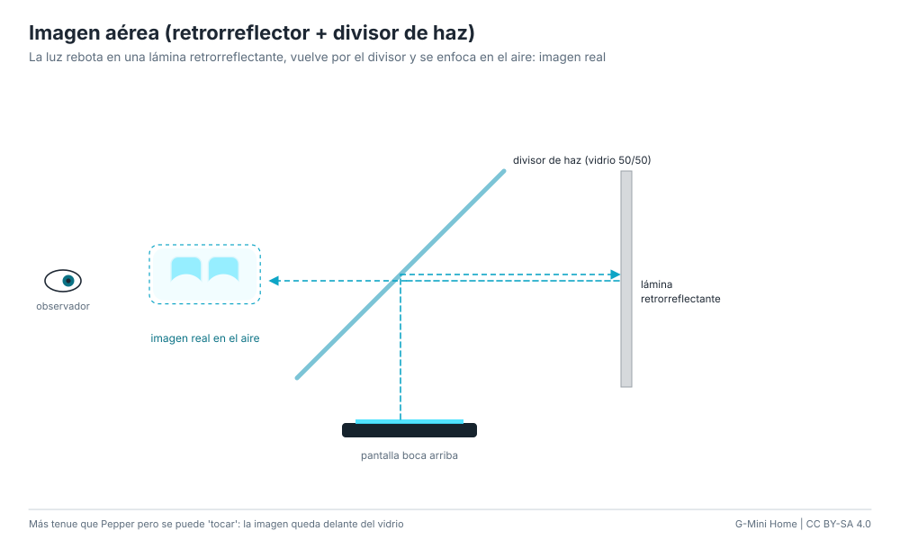

# Imagen aérea (retrorreflector + divisor de haz)

A diferencia de Pepper (imagen virtual detrás del vidrio), esta técnica forma
una **imagen real** delante del vidrio: la luz de la pantalla se refleja en un
divisor de haz, rebota en una lámina retrorreflectante (que devuelve cada rayo
por donde vino) y, al atravesar de nuevo el divisor, converge en el aire. La
cara queda flotando delante de todo y se puede "tocar".

**Dificultad:** media. **Costo:** US$ 30-70 / S/ 110-260. **Tiempo:** 2-3 horas.

## Materiales

| Material | Costo |
|---|---|
| Divisor de haz (vidrio o acrílico semiespejado 50/50, "vidrio de teleprompter") | US$ 15-40 / S/ 55-150 |
| Lámina retrorreflectante de microprismas (tipo señal de tránsito, gris o blanca) | US$ 10-25 / S/ 35-95 |
| Pantalla brillante (celular o tablet al máximo brillo) | la que tengas |
| Caja de cartón pluma negro | US$ 3-8 / S/ 10-30 |

## Pasos

1. Pon la pantalla boca arriba y el divisor de haz encima, a 45°.
2. Coloca la lámina retrorreflectante vertical, del lado hacia el que el
   divisor refleja la luz de la pantalla.
3. Mira a través del divisor desde el lado opuesto a la lámina: la cara aparece
   en el aire, delante del vidrio, a la misma distancia del divisor que la
   pantalla.
4. Ajusta distancias: cuanto más cerca está la pantalla del divisor, más cerca
   flota la imagen. Usa la cara con fondo negro y el brillo al máximo.

## Ventajas y desventajas

- Imagen real "tocable": ideal para interfaces sin contacto.
- Pierde mucha luz (cada paso por el divisor deja pasar la mitad): tenue.
- Ángulo de visión limitado; la imagen es algo borrosa con láminas baratas.

## Seguridad

Cantos del vidrio lijados o encintados.
