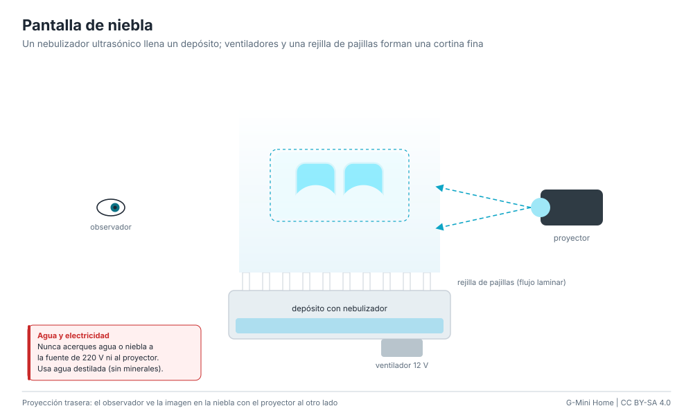

# Pantalla de niebla

Una cortina fina y laminar de niebla de agua recibe la imagen de un proyector
colocado detrás. La niebla es casi invisible a simple vista, pero dispersa la
luz: la cara aparece flotando en el aire y se puede atravesar con la mano.

**Dificultad:** media. **Costo:** US$ 60-200 / S/ 220-750 (sin proyector:
US$ 25-50 / S/ 90-190). **Tiempo:** un fin de semana.

## Materiales

| Material | Costo |
|---|---|
| Nebulizador ultrasónico de 12/24 V (1-3 cabezales) con su fuente | US$ 10-25 / S/ 40-95 |
| Recipiente plástico (40 x 20 x 15 cm aprox.) | US$ 3-8 / S/ 10-30 |
| 1-2 ventiladores de PC de 12 V (80-120 mm) | US$ 3-8 / S/ 10-30 |
| Pajillas (sorbetes) cortadas a 4-6 cm, como panal de flujo laminar | US$ 1-2 / S/ 3-8 |
| Tubo o canal de PVC de 30-60 cm con ranura de 5 mm | US$ 3-8 / S/ 10-30 |
| Proyector (mini LED o un proyector viejo) | US$ 40-150 / S/ 150-560 |
| Agua destilada | US$ 1-2 / S/ 3-8 |

## Pasos

1. Pon el nebulizador en el recipiente con agua destilada (nivel según su
   flotador).
2. Tapa el recipiente y monta los ventiladores soplando hacia adentro: empujan
   la niebla hacia la salida superior.
3. Encima, fija el canal con la ranura y llénalo de pajillas paradas, bien
   apretadas: convierten el flujo turbulento en una cortina lisa (laminar).
4. Regula los ventiladores (bajo voltaje o un regulador PWM) hasta que la
   cortina suba recta 30-60 cm sin abrirse.
5. Pon el proyector detrás de la cortina, a la altura del centro, y proyecta la
   cara a pantalla completa con fondo negro (`gmini_pi --windowed` en la PC del
   proyector, o la página de kiosco).
6. Oscurece la sala. El observador mira desde el lado opuesto al proyector.

## Ventajas y desventajas

- El efecto más "de película": la imagen está en el aire y se atraviesa.
- Se ve mejor de frente al proyector (la niebla dispersa más hacia adelante).
- Corrientes de aire la deforman; necesita oscuridad.
- Moja lo que está cerca si la cortina es muy densa.

## Seguridad

Baja tensión (12/24 V) dentro y cerca del agua; la fuente de 220 V afuera y
por encima del nivel del agua. Proyector y electrónica lejos de la niebla. Ver
[seguridad: agua y niebla](../safety.md#agua-niebla-y-humo-hologramas).
