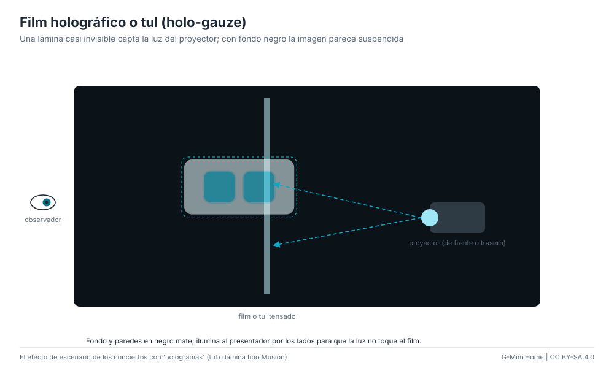

# Film holográfico o tul (holo-gauze)

Una lámina casi transparente (film de retroproyección "holográfico" o un tul
especial) tensada delante de un fondo negro recibe la imagen de un proyector.
Con la sala a oscuras, la lámina desaparece y queda solo la imagen suspendida:
es la técnica de los conciertos con artistas "en holograma".

**Dificultad:** media. **Costo:** US$ 30-150 / S/ 110-560 sin proyector.
**Tiempo:** 2-3 horas.

## Materiales

| Material | Costo |
|---|---|
| Film holográfico de retroproyección (transparente gris) por m² | US$ 20-60 / S/ 75-225 |
| *o* tul holográfico (holo-gauze) por m² | US$ 15-40 / S/ 55-150 |
| Marco de aluminio o PVC para tensar | US$ 10-30 / S/ 35-110 |
| Tela negra para fondo y paredes | US$ 10-30 / S/ 35-110 |
| Proyector de 2000 lúmenes o más | US$ 60-300 / S/ 225-1125 |

## Pasos

1. Tensa el film o el tul en el marco, sin arrugas (el film se pega sobre un
   acrílico o vidrio; el tul se tensa con resortes).
2. Fondo negro mate detrás, a 1-2 m, para que la lámina no se note.
3. Proyector: film de retroproyección, desde atrás; tul, desde adelante y algo
   arriba, para que el haz no deslumbre al público.
4. Proyecta la cara con fondo negro (`gmini_pi` en la PC del proyector). Todo
   lo negro desaparece; solo quedan los ojos.
5. Ilumina a las personas que estén "detrás" de la imagen desde los costados,
   sin que la luz toque la lámina.

## Ventajas y desventajas

- Escala de escenario y muy convincente para el público de frente.
- La lámina se ve si le da luz: exige control de la iluminación.
- Necesita un proyector brillante.

## Seguridad

No mires al haz del proyector. Fija bien el marco: una lámina grande hace
"vela" con el viento.
