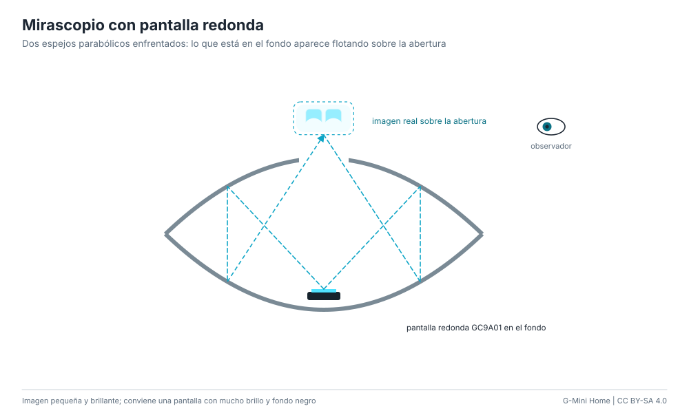

# Mirascopio con pantalla redonda

Dos espejos parabólicos enfrentados (el de arriba con un agujero en el centro)
forman la imagen real de lo que está en el fondo justo sobre la abertura. El
juguete clásico muestra una moneda "flotando"; si en el fondo pones una
pantalla redonda GC9A01 con la cara, los ojos aparecen flotando arriba.

**Dificultad:** fácil. **Costo:** US$ 15-40 / S/ 55-150. **Tiempo:** 1 hora.

## Materiales

| Material | Costo |
|---|---|
| Mirascopio de juguete de 15-23 cm | US$ 10-25 / S/ 35-95 |
| Pantalla GC9A01 de 1,28" y un ESP32-S3 (variante `esp32s3-gc9a01`) | US$ 10-15 / S/ 75-105 |
| Cable plano fino para sacar la conexión | US$ 1-2 / S/ 3-8 |

## Pasos

1. Abre el mirascopio y pega la pantalla en el centro del espejo inferior, mirando
   hacia arriba. Saca el cable por el borde (los espejos se unen a presión).
2. Graba el firmware `esp32s3-gc9a01` y sube el brillo al máximo
   (`brillo 255` en la consola).
3. Cierra el mirascopio: la cara aparece sobre la abertura superior. Mira desde
   un costado, un poco por encima.

## Ventajas y desventajas

- Imagen real nítida y sorprendente, ocupa muy poco.
- Muy pequeña (del tamaño de la pantalla) y sensible a la luz del techo.
- El cable de la pantalla tiene que pasar entre los espejos.

## Seguridad

Sin riesgos especiales. El ESP32 y la pantalla calientan poco, pero deja el
cable con algo de holgura para no doblarlo.
