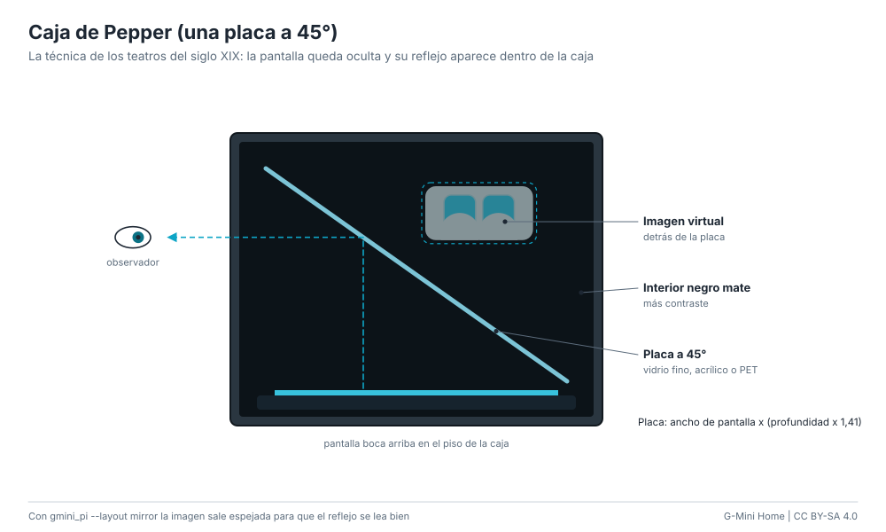

# Caja de Pepper (una placa a 45°)

La versión de teatro del siglo XIX: una pantalla boca arriba en el piso de una
caja oscura y una placa transparente a 45° delante del observador. La pantalla
queda oculta y su reflejo aparece "dentro" de la caja, detrás del vidrio, con
lo que haya al fondo visible a través de la cara.

**Dificultad:** fácil. **Costo:** US$ 10-40 / S/ 35-150. **Tiempo:** 2-3 horas.

## Medidas

Para una pantalla de largo L y ancho (profundidad) P:

- Placa: L x (P x 1,41).
- Interior de la caja: L de ancho, P de profundidad y al menos P de alto.
- Tabla de tamaños comunes en [hardware/templates/README.md](../../hardware/templates/README.md#caja-de-pepper-una-placa-a-45).

## Materiales

| Material | Costo |
|---|---|
| Vidrio fino de 2 mm (vidriería), acrílico de 2 mm o PET de 0,5 mm | US$ 3-15 / S/ 10-55 |
| Cartón pluma o MDF de 3 mm para la caja | US$ 3-12 / S/ 10-45 |
| Pintura negra mate o cartulina negra | US$ 2-5 / S/ 6-18 |
| Tablet, monitor chico o pantalla HDMI | la que tengas |

## Pasos

1. Arma una caja abierta por delante, con el interior negro mate (cuanto más
   negro, más contraste).
2. Pon la pantalla boca arriba en el piso de la caja.
3. Fija la placa en diagonal: arriba contra la pared del fondo y abajo contra el
   borde frontal del piso (45°). Ranuras en las paredes laterales o dos listones
   triangulares sirven de guía.
4. Muestra la cara espejada: `python -m gmini_pi --layout mirror` o el kiosco
   con `?layout=mirror`. Si la cara sale cabeza abajo, gira la pantalla 180°.
5. Opcional: pon un objeto real al fondo de la caja (una figura, una planta):
   la cara flota delante de él.

## Ventajas y desventajas

- Muy brillante y nítida, incluso con algo de luz en la sala.
- Puede ser tan grande como la pantalla que pongas.
- Se ve bien desde un solo lado y en un ángulo de unos 60°.
- El vidrio refleja también la sala: cuanto más oscuro el frente, mejor.

## Seguridad

Lija o encinta los cantos del vidrio. No dejes la pantalla en una caja
cerrada sin ventilación durante horas.
