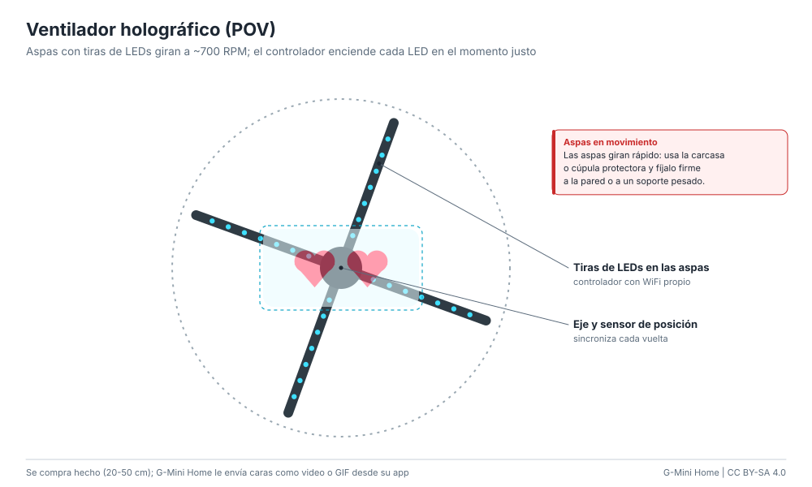

# Ventilador holográfico (POV)

Aspas con tiras de LEDs que giran a 600-800 RPM; un controlador enciende cada
LED en el instante justo de cada vuelta y la persistencia de la visión
"pinta" una imagen que parece flotar en el aire, con mucha profundidad aparente.

**Dificultad:** fácil comprado, alta casero. **Costo:** US$ 60-150 / S/ 220-560
(25-65 cm). **Tiempo:** 1 hora (montaje).

## Materiales

| Material | Costo |
|---|---|
| Ventilador holográfico comercial de 30-65 cm con app o WiFi | US$ 60-150 / S/ 220-560 |
| Cúpula o carcasa protectora (muchos la traen) | US$ 10-30 / S/ 35-110 |
| Soporte de pared firme | US$ 5-15 / S/ 18-55 |

Casero: aspas impresas, tira APA102 (no WS2812: hace falta refresco rápido), un
ESP32, un sensor Hall con imán para sincronizar y un motor brushless con
variador. Es un proyecto avanzado por el equilibrado y la seguridad.

## Pasos (comercial)

1. Fija el soporte a la pared o a una base pesada y monta el ventilador con la
   protección puesta.
2. Exporta un video corto de la cara en formato cuadrado y fondo negro: graba
   la pantalla de `python -m gmini_pi --demo --windowed` (por ejemplo con OBS)
   o usa las imágenes de `docs/img/`.
3. Conviértelo con la herramienta del fabricante y súbelo por su app.
4. Para que reaccione en vivo: algunos modelos aceptan transmisión por WiFi o
   HDMI; si no, prepara un video por emoción y cámbialos desde el agente.

## Ventajas y desventajas

- Muy llamativo y brillante, se ve con luz ambiente.
- Imagen grande con poco espacio.
- Hace ruido, vibra y la integración en vivo depende del fabricante.
- Las aspas son peligrosas sin protección.

## Seguridad

Siempre con la cúpula o protección, fijación firme y fuera del alcance de
niños y mascotas. Ver [seguridad](../safety.md#ventiladores-pov-y-piezas-giratorias).
