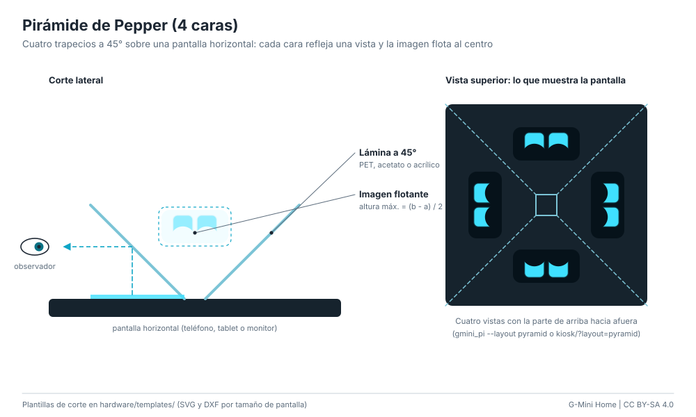

# Pirámide de Pepper (4 caras)

Cuatro trapecios transparentes forman una pirámide invertida apoyada sobre una
pantalla horizontal. Cada cara está a 45° y refleja una de las cuatro vistas
que muestra la pantalla; el observador ve la cara flotando dentro de la
pirámide, desde cualquiera de los cuatro lados.

**Dificultad:** muy fácil. **Costo:** US$ 1-25 / S/ 3-90. **Tiempo:** 15 min (PET) a 1 h (acrílico).

## Medidas

Plantillas listas para imprimir o cortar en [hardware/templates/](../../hardware/templates/README.md)
(SVG a escala 1:1 y DXF), para teléfono 6,1" y 6,7", tablets de 8", 10,1" y 11",
portátil de 15,6", monitores de 24" y 27" y TV de 32". Para otro tamaño:

- **b** (lado mayor) = 95 % del lado corto útil de la pantalla.
- **a** (lado menor) = b / 6.
- Altura de la pirámide = (b - a) / 2. Alto de cada trapecio = altura x 1,414.
- Los lados del trapecio forman 54,74° con la base.
- La imagen flotante mide como máximo la altura de la pirámide.

Ejemplo, teléfono de 6,1": b = 60 mm, a = 10 mm, trapecio de 35,4 mm de alto.

## Materiales

| Material | Para | Costo |
|---|---|---|
| Lámina PET o acetato 0,5 mm (tapa de carpeta, blíster transparente, caja de CD) | Teléfono y tablet | US$ 0-2 / S/ 0-8 |
| PETG o acrílico 2-3 mm | Monitor o TV | US$ 10-25 / S/ 35-90 por plancha |
| Cinta transparente o pegamento UV | Unir aristas | US$ 1-5 / S/ 3-20 |
| Opcional: marco impreso ([pepper_pyramid.scad](../../hardware/enclosures/pepper_pyramid.scad)) | Sin pegamento | ~10 g de PLA |

## Pasos

1. Imprime la plantilla al 100 % (sin "ajustar a la página") y comprueba la
   regla de 50 mm.
2. Lámina fina: pega la plantilla debajo, marca con cutter las líneas azules
   (pliegues) sin atravesar y corta las rojas. Dobla y cierra con la pestaña.
3. Acrílico: corta los cuatro trapecios del DXF de piezas (láser o sierra de
   calar), lija los cantos y únelos por fuera con cinta o pegamento UV. Las
   aristas quedan a 120°: un bisel de 30° en los cantos laterales mejora la
   unión.
4. En la pantalla abre la cara en disposición de pirámide:
   - Raspberry Pi o PC: `python -m gmini_pi --layout pyramid` (o
     `display.layout = "pyramid"`).
   - Tablet: `http://IP:8088/?layout=pyramid` (kiosco) o `?layout=pyramid&demo=1`.
5. Apoya la pirámide con la punta chica al centro de las cuatro vistas, apaga la
   luz y mira de frente a una de las caras, a la altura de la pirámide.

## Ventajas y desventajas

- Más barata imposible y se ve desde cuatro lados.
- Funciona con el celular que ya tienes.
- La imagen es chica (hasta la altura de la pirámide) y necesita poca luz.
- Las láminas gruesas dan imagen doble (reflejan ambas caras): usa la más
  fina que mantenga la forma.

## Seguridad

Cutter con regla metálica y corte hacia afuera del cuerpo. El acrílico astilla
al romperlo por la marca: lentes de protección.
