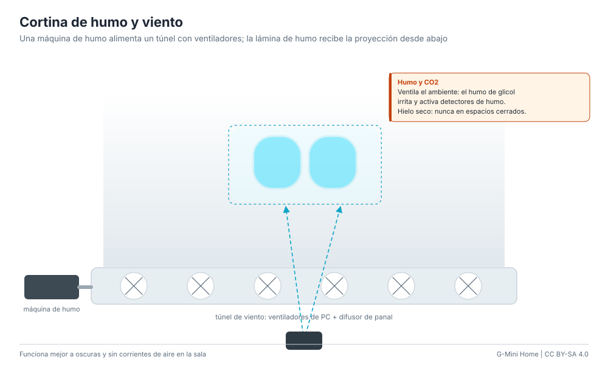

# Cortina de humo y viento

Parecida a la pantalla de niebla, pero más grande: una máquina de humo
alimenta un túnel de viento con ventiladores y un difusor tipo panal, que
forma una lámina de humo vertical. Un proyector desde abajo o desde atrás pone
la cara sobre ella.

**Dificultad:** media. **Costo:** US$ 80-250 / S/ 300-950. **Tiempo:** un fin de semana.

## Materiales

| Material | Costo |
|---|---|
| Máquina de humo de 400-900 W con fluido | US$ 35-80 / S/ 130-300 |
| 4-6 ventiladores de PC de 12 V y una fuente de 12 V / 3 A | US$ 15-30 / S/ 55-110 |
| Caja de MDF o cartón pluma de 60-100 cm de largo | US$ 10-25 / S/ 35-95 |
| Panal de pajillas o malla de panal de abeja (honeycomb) | US$ 3-15 / S/ 10-55 |
| Proyector | US$ 40-150 / S/ 150-560 |

## Pasos

1. Arma un túnel largo y bajo; los ventiladores en la base soplan hacia arriba.
2. Cierra la salida superior con el panal (5-8 cm de profundidad) para que el
   aire salga parejo.
3. Conecta la salida de la máquina de humo a un costado del túnel.
4. Ajusta la velocidad de los ventiladores hasta que la lámina suba recta
   1-2 m; demasiado aire la rompe, muy poco la deja caer.
5. Proyecta la cara desde abajo en ángulo o desde atrás, en una sala oscura y
   sin corrientes.

## Ventajas y desventajas

- Tamaño de escenario y efecto espectacular.
- Consume fluido y la sala termina con humo: no es para todos los días.
- Las corrientes de aire la deforman.

## Seguridad

El fluido de glicol irrita y activa detectores de humo: ventila y avisa. El
hielo seco desplaza el oxígeno: nunca en espacios cerrados. No apuntes el
proyector a los ojos. Ver [seguridad](../safety.md#agua-niebla-y-humo-hologramas).
