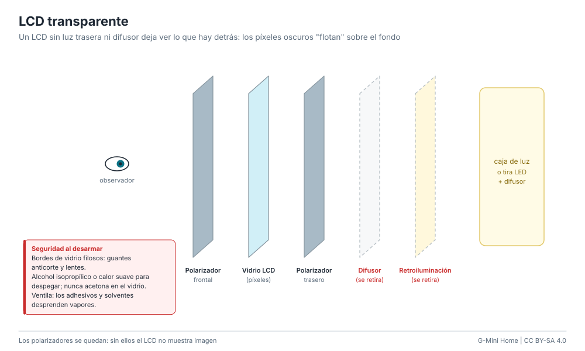

# LCD transparente

Un panel LCD no emite luz: solo deja pasar o bloquea la luz de su
retroiluminación. Si se retiran la retroiluminación y el difusor, el panel se
vuelve una ventana que muestra la imagen sobre lo que haya detrás. Con una caja
de luz al fondo (o un objeto iluminado), la cara oscura "flota" sobre la
escena. Es la técnica de las vitrinas transparentes de las tiendas.

**Dificultad:** media-alta. **Costo:** US$ 0-60 / S/ 0-230 (un monitor viejo
sirve). **Tiempo:** 2-4 horas.

## Materiales

| Material | Costo |
|---|---|
| Monitor LCD viejo (mejor LED que CCFL) o panel con placa controladora HDMI | US$ 0-50 / S/ 0-190 |
| Caja de luz: tira LED blanca + acrílico opal, o un panel LED de techo | US$ 5-20 / S/ 18-75 |
| Guantes anticorte, lentes, destornilladores, espátulas plásticas | US$ 5-10 / S/ 18-38 |
| Alcohol isopropílico y secador de pelo | US$ 3-5 / S/ 10-18 |

## Pasos

1. Desenchufa el monitor y espera varios minutos (los CCFL tienen alta
   tensión). Ponte guantes y lentes.
2. Retira la carcasa y el marco metálico con cuidado: los flex del panel se
   cortan fácil.
3. Separa el panel LCD (vidrio con sus flex y placa) del bloque de
   retroiluminación: debajo hay láminas difusoras, prismáticas y el guía de luz.
   Retíralas todas; deja **solo el vidrio con sus dos polarizadores**.
4. Algunos paneles traen un polarizador trasero difusor (mate): si la imagen
   se ve lechosa, cámbialo por una lámina polarizadora transparente orientada
   igual que la original (marca la orientación antes de despegar). Despega con
   calor suave o alcohol isopropílico, **nunca con acetona**.
5. Reconecta la placa del panel a su controladora y monta el vidrio en un marco
   rígido, sin presionarlo.
6. Pon detrás una caja de luz o una escena iluminada. En un LCD
   transparente el blanco es transparente y el negro es opaco, así que invierte
   los colores: `display.invert = true` en el cliente de la Pi o
   `?invert=1` en la página de kiosco. Los ojos quedan oscuros sobre la escena.

## Ventajas y desventajas

- Mezcla la cara con objetos reales: la cara "habita" una vitrina.
- Reaprovecha un monitor viejo.
- Pierde mucho brillo: hace falta mucha luz detrás.
- Desarme delicado: un flex roto inutiliza el panel.

## Seguridad

Vidrio filoso, alta tensión en los CCFL y en sus inversores, mercurio en los
tubos, solventes inflamables. Ver [seguridad: LCD transparente](../safety.md#lcd-transparente).
