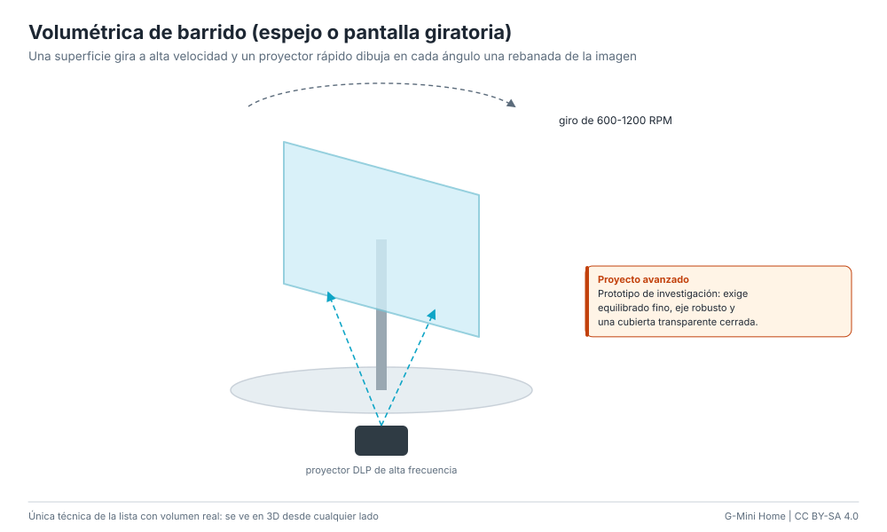

# Volumétrica de barrido (espejo o pantalla giratoria)

Una superficie (pantalla difusora o espejo inclinado) gira muy rápido mientras
un proyector de alta frecuencia dibuja en cada ángulo la "rebanada" de la imagen
3D que corresponde. El ojo integra todas las rebanadas: la cara ocupa un volumen
real y se ve en 3D desde cualquier lado, sin gafas.

**Dificultad:** muy alta (proyecto de investigación). **Costo:** US$ 100-400 /
S/ 375-1500. **Tiempo:** semanas.

## Materiales

| Material | Costo |
|---|---|
| Proyector DLP de alta frecuencia (kits de desarrollo DLP o un DMD reutilizado) | US$ 60-250 / S/ 220-940 |
| Motor brushless con variador y sensor de posición (encoder o Hall) | US$ 20-60 / S/ 75-225 |
| Superficie difusora rígida y liviana (acrílico esmerilado) | US$ 5-15 / S/ 18-55 |
| Cúpula de acrílico transparente | US$ 20-60 / S/ 75-225 |
| Microcontrolador para sincronizar motor y proyector | US$ 5-15 / S/ 18-55 |

## Pasos (resumen)

1. Monta la superficie centrada en el eje y equilíbrala con pesos hasta que no
   vibre a 600-1200 RPM.
2. Sincroniza la posición del motor con el proyector: cada cuadro se proyecta en
   un ángulo fijo (por ejemplo 100-200 rebanadas por vuelta).
3. Genera las rebanadas a partir de un modelo 3D de la cara (por ejemplo,
   extruyendo los ojos del motor como volúmenes) y envíalas al proyector.
4. Encierra todo en la cúpula antes de hacer girar el motor.

## Ventajas y desventajas

- Es la única técnica de la lista con volumen real.
- Requiere sincronización precisa, proyector especial y mucho ajuste.
- Imagen pequeña y tenue; el motor hace ruido.

## Seguridad

Superficie girando a alta velocidad: equilibrado, eje robusto y cúpula cerrada
siempre. Ver [seguridad](../safety.md#ventiladores-pov-y-piezas-giratorias).
