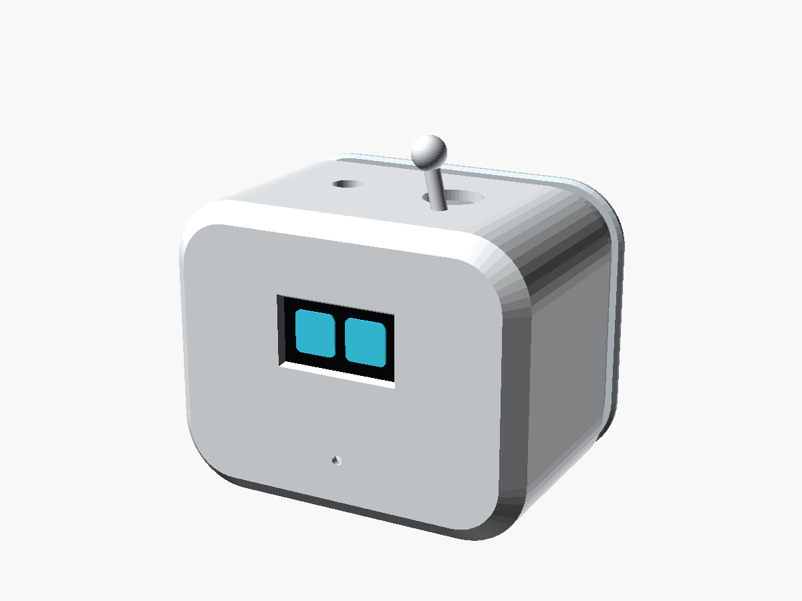
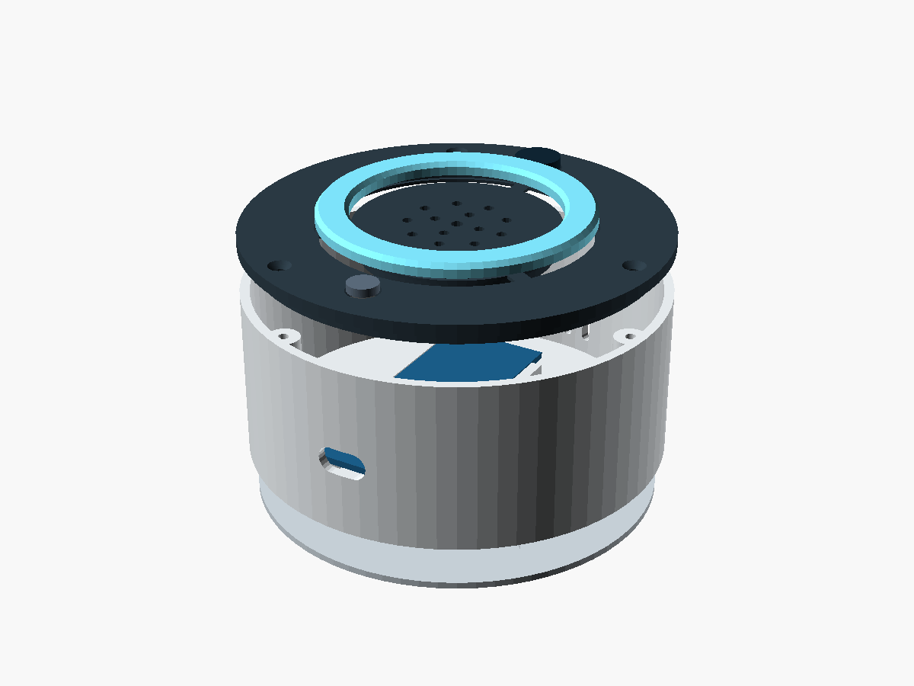
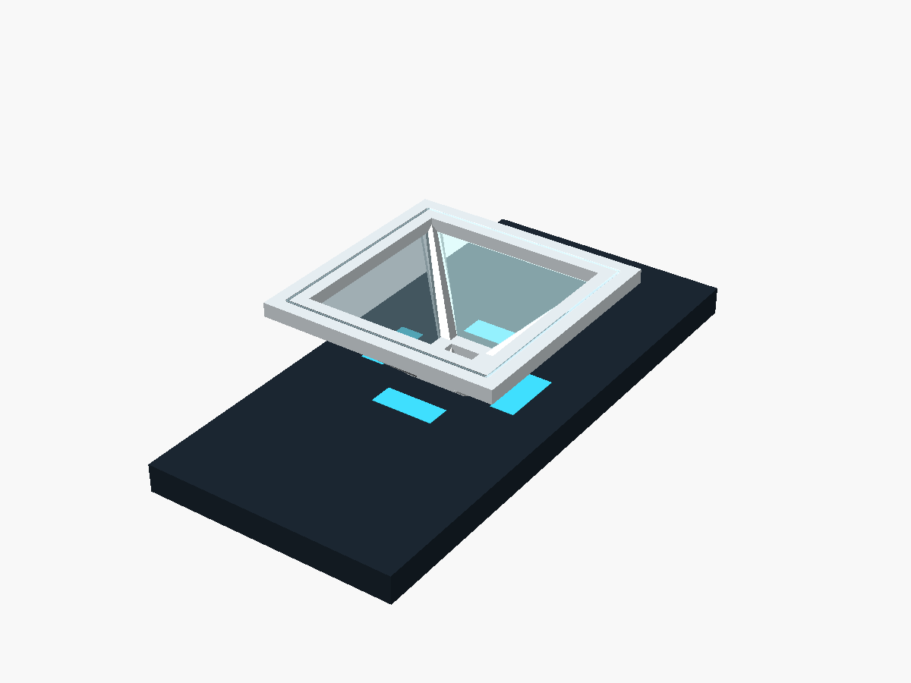

# Hardware

Todo lo físico de G-Mini Home: listas de materiales, cableado, carcasas
imprimibles y plantillas de corte. Licencia de estos diseños: CC BY-SA 4.0
([LICENSE-hardware.md](../LICENSE-hardware.md)).

| Carpeta | Contenido | Se genera con |
|---|---|---|
| [bom.md](bom.md) | Lista de materiales por variante con precios USD y PEN | a mano |
| [wiring/](wiring/) | Diagramas SVG y tablas de conexión por variante | `python tools/diagrams/build_all.py` |
| [enclosures/](enclosures/) | Carcasas paramétricas en OpenSCAD | a mano |
| [stl/](stl/) | Piezas listas para imprimir (STL binario) | `python tools/render_enclosures.py` |
| [renders/](renders/) | Imágenes de piezas y conjuntos | `python tools/render_enclosures.py` |
| [templates/](templates/) | Plantillas de corte de la pirámide de Pepper (SVG 1:1 y DXF) | `python tools/templates/pepper_pyramid.py` |

## Cableado

| Variante | Diagrama | Tabla |
|---|---|---|
| ESP32-S3 + OLED | [SVG](wiring/esp32s3-oled.svg) | [esp32s3-oled.md](wiring/esp32s3-oled.md) |
| ESP32-S3 + ST7789 / GC9A01 | [SVG](wiring/esp32s3-tft.svg) | [esp32s3-tft.md](wiring/esp32s3-tft.md) |
| ESP32-S3 parlante con LEDs | [SVG](wiring/esp32s3-speaker.svg) | [esp32s3-speaker.md](wiring/esp32s3-speaker.md) |
| ESP32-S3 + relés y LDR | [SVG](wiring/esp32s3-relays.svg) | [esp32s3-relays.md](wiring/esp32s3-relays.md) |
| ESP32 clásico (DevKit V1) | [SVG](wiring/esp32dev.svg) | [esp32dev.md](wiring/esp32dev.md) |
| Arduino Uno / Nano por USB | [SVG](wiring/arduino-usb-face.svg) | [arduino-usb-face.md](wiring/arduino-usb-face.md) |
| Raspberry Pi (botones) | [SVG](wiring/raspberry-pi.svg) | [raspberry-pi.md](wiring/raspberry-pi.md) |


## Carcasas

| Modelo | Piezas | Vista |
|---|---|---|
| [oled_companion.scad](enclosures/oled_companion.scad): cabecita para la OLED | [cuerpo](stl/oled_companion-shell.stl), [tapa](stl/oled_companion-back.stl) |  |
| [speaker_puck.scad](enclosures/speaker_puck.scad): parlante con anillo LED | [cuerpo](stl/speaker_puck-base.stl), [tapa](stl/speaker_puck-top.stl), [difusor](stl/speaker_puck-diffuser.stl), [fondo](stl/speaker_puck-bottom.stl) |  |
| [pepper_pyramid.scad](enclosures/pepper_pyramid.scad): marco de la pirámide | [marco](stl/pepper_pyramid-frame.stl) |  |

### Impresión

- PLA o PETG, capa de 0,2 mm, 3 perímetros, 15-20 % de relleno.
- `oled_companion`: el cuerpo se imprime con la cara apoyada en la cama; la
  antena decorativa necesita un soporte pequeño (o ponla en `antenna = false`).
  La tapa se imprime con la cara exterior hacia abajo.
- `speaker_puck`: cuerpo y fondo sin soportes; la tapa boca abajo; el difusor
  en PETG natural o PLA blanco al 100 % de relleno para que la luz se reparta.
- `pepper_pyramid`: marco boca abajo (aro grande en la cama), sin soportes.
- Ajusta las medidas a tus módulos con el Customizer de OpenSCAD
  (Ventana > Personalizador): cada parámetro tiene un comentario.

### Exportar tus cambios

```bash
python tools/render_enclosures.py              # STL + PNG de todo
python tools/render_enclosures.py --only puck  # solo el parlante
```

El script busca OpenSCAD en `$OPENSCAD`, en el `PATH` o en
`E:\tools\openscad` (Windows). En Linux sin escritorio usa `xvfb-run`.
