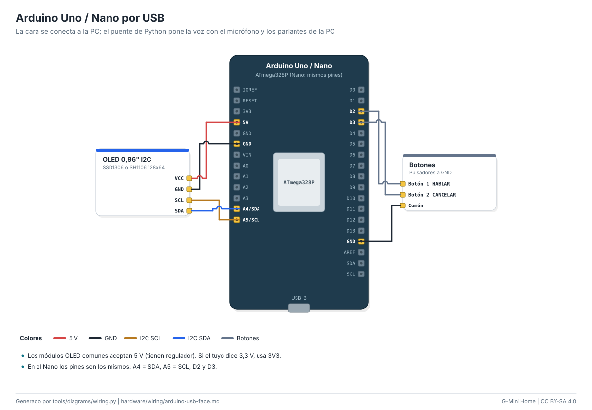

# Cableado: Arduino Uno / Nano por USB

La cara se conecta a la PC; el puente de Python pone la voz con el micrófono y los parlantes de la PC.

| Módulo | Pin del módulo | Pin de la placa | Función |
|---|---|---|---|
| OLED 0,96" I2C | `VCC` | `5V` | 5 V |
| OLED 0,96" I2C | `GND` | `GND` | GND |
| OLED 0,96" I2C | `SCL` | `A5/SCL` | I2C SCL |
| OLED 0,96" I2C | `SDA` | `A4/SDA` | I2C SDA |
| Botones | `Botón 1 HABLAR` | `D2` | Botones |
| Botones | `Botón 2 CANCELAR` | `D3` | Botones |
| Botones | `Común` | `GND` | GND |

Notas:

- Los módulos OLED comunes aceptan 5 V (tienen regulador). Si el tuyo dice 3,3 V, usa 3V3.
- En el Nano los pines son los mismos: A4 = SDA, A5 = SCL, D2 y D3.

Guía paso a paso: [docs/guides/usb-face.md](../../docs/guides/usb-face.md). Seguridad: [docs/safety.md](../../docs/safety.md).

<!-- Generado por tools/diagrams/wiring.py: no editar a mano. -->
