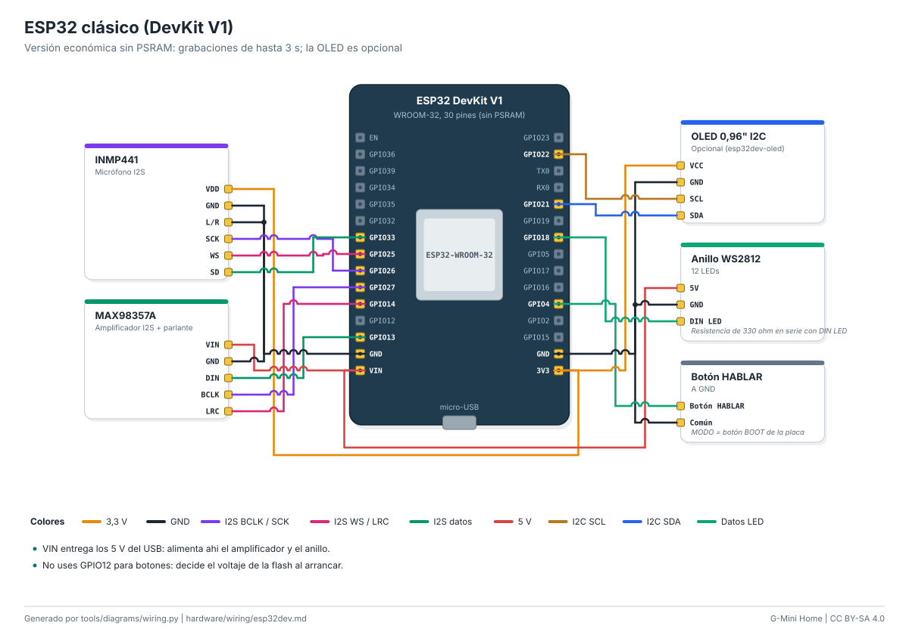

# Cableado: ESP32 clásico (DevKit V1)

Versión económica sin PSRAM: grabaciones de hasta 3 s; la OLED es opcional.

| Módulo | Pin del módulo | Pin de la placa | Función |
|---|---|---|---|
| INMP441 | `VDD` | `3V3` | 3,3 V |
| INMP441 | `GND` | `GND` | GND |
| INMP441 | `L/R` | `GND` | GND |
| INMP441 | `SCK` | `GPIO26` | I2S BCLK / SCK |
| INMP441 | `WS` | `GPIO25` | I2S WS / LRC |
| INMP441 | `SD` | `GPIO33` | I2S datos |
| MAX98357A | `VIN` | `VIN` | 5 V |
| MAX98357A | `GND` | `GND` | GND |
| MAX98357A | `DIN` | `GPIO13` | I2S datos |
| MAX98357A | `BCLK` | `GPIO27` | I2S BCLK / SCK |
| MAX98357A | `LRC` | `GPIO14` | I2S WS / LRC |
| OLED 0,96" I2C | `VCC` | `3V3` | 3,3 V |
| OLED 0,96" I2C | `GND` | `GND` | GND |
| OLED 0,96" I2C | `SCL` | `GPIO22` | I2C SCL |
| OLED 0,96" I2C | `SDA` | `GPIO21` | I2C SDA |
| Anillo WS2812 | `5V` | `VIN` | 5 V |
| Anillo WS2812 | `GND` | `GND` | GND |
| Anillo WS2812 | `DIN LED` | `GPIO18` | Datos LED |
| Botón HABLAR | `Botón HABLAR` | `GPIO4` | Botones |
| Botón HABLAR | `Común` | `GND` | GND |

Notas:

- VIN entrega los 5 V del USB: alimenta ahi el amplificador y el anillo.
- No uses GPIO12 para botones: decide el voltaje de la flash al arrancar.
- Anillo WS2812: Resistencia de 330 ohm en serie con DIN LED.
- Botón HABLAR: MODO = botón BOOT de la placa.

Guía paso a paso: [docs/guides/speaker.md](../../docs/guides/speaker.md). Seguridad: [docs/safety.md](../../docs/safety.md).

<!-- Generado por tools/diagrams/wiring.py: no editar a mano. -->
