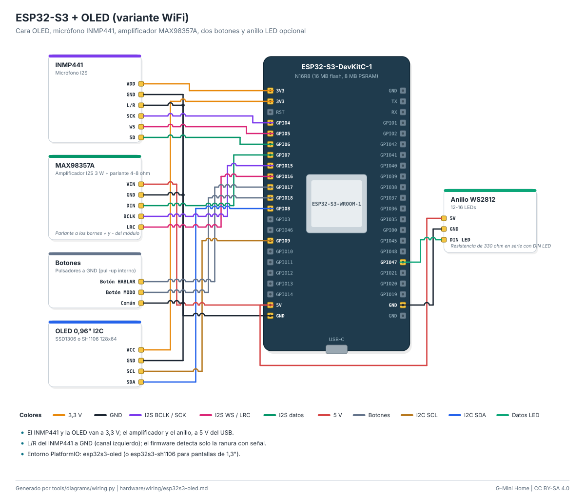

# Cableado: ESP32-S3 + OLED (variante WiFi)

Cara OLED, micrófono INMP441, amplificador MAX98357A, dos botones y anillo LED opcional.

| Módulo | Pin del módulo | Pin de la placa | Función |
|---|---|---|---|
| INMP441 | `VDD` | `3V3` | 3,3 V |
| INMP441 | `GND` | `GND` | GND |
| INMP441 | `L/R` | `GND` | GND |
| INMP441 | `SCK` | `GPIO4` | I2S BCLK / SCK |
| INMP441 | `WS` | `GPIO5` | I2S WS / LRC |
| INMP441 | `SD` | `GPIO6` | I2S datos |
| MAX98357A | `VIN` | `5V` | 5 V |
| MAX98357A | `GND` | `GND` | GND |
| MAX98357A | `DIN` | `GPIO7` | I2S datos |
| MAX98357A | `BCLK` | `GPIO15` | I2S BCLK / SCK |
| MAX98357A | `LRC` | `GPIO16` | I2S WS / LRC |
| Botones | `Botón HABLAR` | `GPIO17` | Botones |
| Botones | `Botón MODO` | `GPIO18` | Botones |
| Botones | `Común` | `GND` | GND |
| OLED 0,96" I2C | `VCC` | `3V3` | 3,3 V |
| OLED 0,96" I2C | `GND` | `GND` | GND |
| OLED 0,96" I2C | `SCL` | `GPIO9` | I2C SCL |
| OLED 0,96" I2C | `SDA` | `GPIO8` | I2C SDA |
| Anillo WS2812 | `5V` | `5V` | 5 V |
| Anillo WS2812 | `GND` | `GND` | GND |
| Anillo WS2812 | `DIN LED` | `GPIO47` | Datos LED |

Notas:

- El INMP441 y la OLED van a 3,3 V; el amplificador y el anillo, a 5 V del USB.
- L/R del INMP441 a GND (canal izquierdo); el firmware detecta solo la ranura con señal.
- Entorno PlatformIO: esp32s3-oled (o esp32s3-sh1106 para pantallas de 1,3").
- MAX98357A: Parlante a los bornes + y - del módulo.
- Anillo WS2812: Resistencia de 330 ohm en serie con DIN LED.

Guía paso a paso: [docs/guides/esp32-wifi.md](../../docs/guides/esp32-wifi.md). Seguridad: [docs/safety.md](../../docs/safety.md).

<!-- Generado por tools/diagrams/wiring.py: no editar a mano. -->
