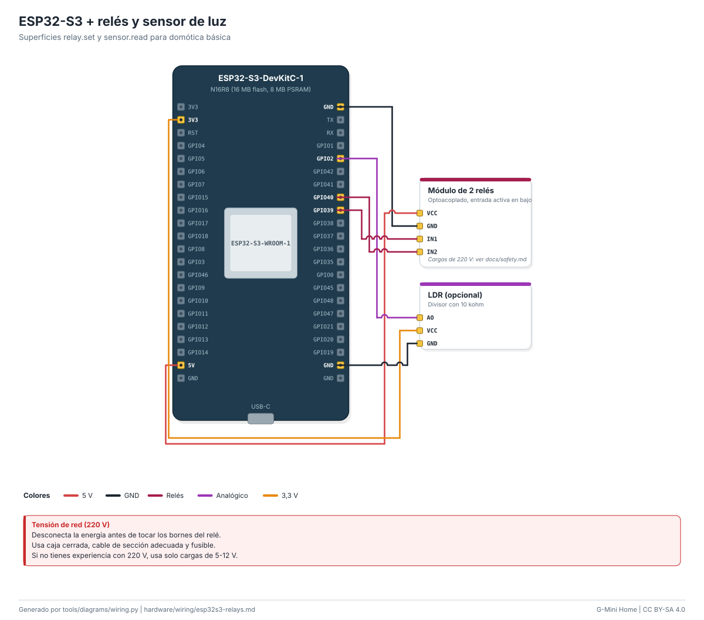

# Cableado: ESP32-S3 + relés y sensor de luz

Superficies relay.set y sensor.read para domótica básica.

| Módulo | Pin del módulo | Pin de la placa | Función |
|---|---|---|---|
| Módulo de 2 relés | `VCC` | `5V` | 5 V |
| Módulo de 2 relés | `GND` | `GND` | GND |
| Módulo de 2 relés | `IN1` | `GPIO39` | Relés |
| Módulo de 2 relés | `IN2` | `GPIO40` | Relés |
| LDR (opcional) | `AO` | `GPIO2` | Analógico |
| LDR (opcional) | `VCC` | `3V3` | 3,3 V |
| LDR (opcional) | `GND` | `GND` | GND |
- Módulo de 2 relés: Cargas de 220 V: ver docs/safety.md.

> **Tensión de red (220 V).** Desconecta la energía antes de tocar los bornes del relé. Usa caja cerrada, cable de sección adecuada y fusible. Si no tienes experiencia con 220 V, usa solo cargas de 5-12 V.

Guía paso a paso: [docs/guides/esp32-wifi.md](../../docs/guides/esp32-wifi.md). Seguridad: [docs/safety.md](../../docs/safety.md).

<!-- Generado por tools/diagrams/wiring.py: no editar a mano. -->
