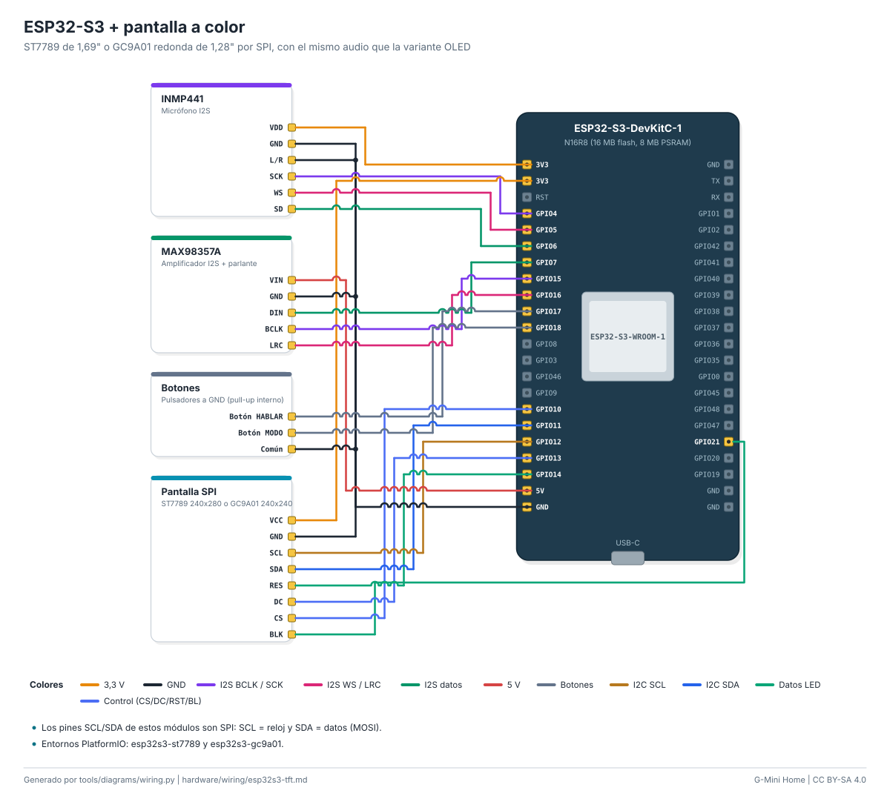

# Cableado: ESP32-S3 + pantalla a color

ST7789 de 1,69" o GC9A01 redonda de 1,28" por SPI, con el mismo audio que la variante OLED.

| Módulo | Pin del módulo | Pin de la placa | Función |
|---|---|---|---|
| INMP441 | `VDD` | `3V3` | 3,3 V |
| INMP441 | `GND` | `GND` | GND |
| INMP441 | `L/R` | `GND` | GND |
| INMP441 | `SCK` | `GPIO4` | I2S BCLK / SCK |
| INMP441 | `WS` | `GPIO5` | I2S WS / LRC |
| INMP441 | `SD` | `GPIO6` | I2S datos |
| MAX98357A | `VIN` | `5V` | 5 V |
| MAX98357A | `GND` | `GND` | GND |
| MAX98357A | `DIN` | `GPIO7` | I2S datos |
| MAX98357A | `BCLK` | `GPIO15` | I2S BCLK / SCK |
| MAX98357A | `LRC` | `GPIO16` | I2S WS / LRC |
| Botones | `Botón HABLAR` | `GPIO17` | Botones |
| Botones | `Botón MODO` | `GPIO18` | Botones |
| Botones | `Común` | `GND` | GND |
| Pantalla SPI | `VCC` | `3V3` | 3,3 V |
| Pantalla SPI | `GND` | `GND` | GND |
| Pantalla SPI | `SCL` | `GPIO12` | I2C SCL |
| Pantalla SPI | `SDA` | `GPIO11` | I2C SDA |
| Pantalla SPI | `RES` | `GPIO14` | Datos LED |
| Pantalla SPI | `DC` | `GPIO13` | Control (CS/DC/RST/BL) |
| Pantalla SPI | `CS` | `GPIO10` | Control (CS/DC/RST/BL) |
| Pantalla SPI | `BLK` | `GPIO21` | Datos LED |

Notas:

- Los pines SCL/SDA de estos módulos son SPI: SCL = reloj y SDA = datos (MOSI).
- Entornos PlatformIO: esp32s3-st7789 y esp32s3-gc9a01.

Guía paso a paso: [docs/guides/esp32-wifi.md](../../docs/guides/esp32-wifi.md). Seguridad: [docs/safety.md](../../docs/safety.md).

<!-- Generado por tools/diagrams/wiring.py: no editar a mano. -->
